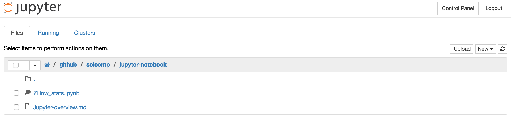
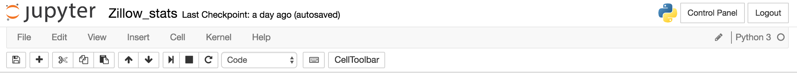
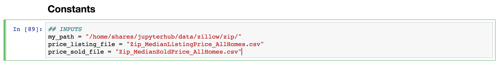

Jupyter Notebook
================

In a nutshell: Jupyter Notebooks enable you to **create documents mixing rich text with live code and data visualizations**. It is a great tool to share your data analysis a with others, collaborate, teach, and promote reproducible science. Born as a Python centric tool (IPython Notebook), the project has diversified. It currently supports around 40 programming languages, including Python, R and Julia (Ju-pyt-R).

Have a look: <https://nbviewer.jupyter.org>

## How to run Jupyter Notebook

- On your local machine, in a terminal type: `jupyter notebook`
- Using a server running Jupyter(hub): https://roy.nceas.ucsb.edu
- Using nbviewer: <https://nbviewer.jupyter.org>

Note that GitHub fully renders (read static view) Jupyter notebooks

## The interface

2 views: 

### Notebook Dashboard 

This is where you lend at login/start. Ffrom the dashboard you can manage and create notebooks or start the terminal.

 

### Notebook editor

This is where you write your notebook. Notebooks are made of cells. Each cell can be executed seperatly.

 

There are 2 modes:

- **Command mode**: Used to navigate around the notebook; selected cell is blue; you can enter this mode by hitting the `Esc` key
 

- **Edit mode**: Used to enter content in the cells; selected cell is green; you can enter this mode by hitting the `Enter` key
 

## How to evaluate a cell

Evaluate the current cell: `Shift` + `Enter`

Evaluate the current cell and add a new empty cell below: `Alt` + `Enter`

## Getting help

Open function search (a la Spotlight) : `Cmd/Ctrl` + `Shift` + `P`

Get the help for a function: `Shift` + `Tab` with the cursor inside the function

## Keyboard shortcuts

From <https://www.dataquest.io/blog/jupyter-notebook-tips-tricks-shortcuts/>

### While in command mode

- `A` to insert a new cell above the current cell
- `B` to insert a new cell below.
- `M` to change the current cell to Markdown
- `Y` to change it back to code
- `D` `D` (press the key twice) to delete the current cell

### While in edit mode 

- `Ctrl` + `Shift` + `-` will split the current cell into two from where your cursor is
- `Esc` + `F` Find and replace on your code but not the outputs
- `Esc` + `O` Toggle cell output
- `Shift` + `J` or `Shift` + `Down` select the next cells in a downwards direction 
- `Shift` + `K` or `Shift` + `Up` select cells in an upwards direction 
- Once cells are selected, you can then delete / copy / cut / paste / run them as a batch. This is helpful when you need to move parts of a notebook
- `Shift` + `M` merge multiple cells

## References

- Project website: <http://jupyter.org>
- Official Documentation: <https://jupyter.readthedocs.io/en/latest/index.html>
- Notebook Viewer: <https://nbviewer.jupyter.org>
- Jupyter shortcuts and tricks: <https://www.dataquest.io/blog/jupyter-notebook-tips-tricks-shortcuts/>
- Jupyter tutorial: <https://www.datacamp.com/community/tutorials/tutorial-jupyter-notebook#gs.FvQnWPo>